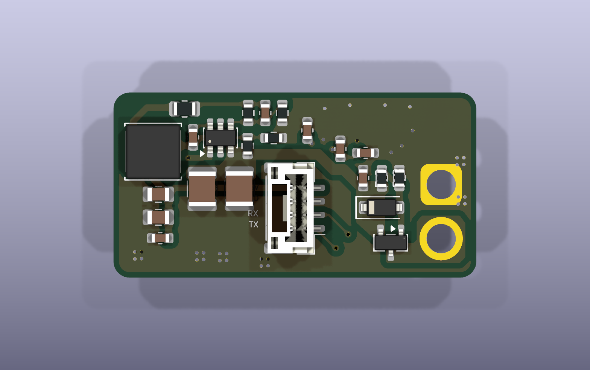
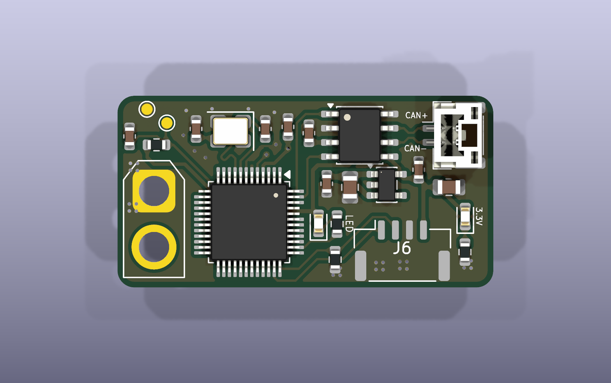

# 项目名称
TTLtoCANforTOF

## 项目简介
面向 ToF 设备的 TTL UART 转 CAN 通信模块，设计目标是通过 24V 输入为 ToF 提供 5V 电源，并由 STM32 完成串口数据与 CAN 报文之间的转换。

## PCB预览

以下预览基于 2026-10-04 23:51 保存的 PCB 文件重新生成。部分器件未配置三维模型，实际装配以封装和 BOM 为准。

正面：

背面：

## 主要参数
PCB 尺寸  36.00 × 20.05 mm，圆角矩形 
层数 / 板厚  2 层 / 1.6 mm 
输入电源  设计标称 24V，经 J4 输入 
ToF 电源  设计目标 5V，经 J3 第 4 脚输出 
板上逻辑电源  3.3V 
主控  STM32G0B1CBTx，LQFP-48 
通信接口  UART（J3）、CAN（J2） 
调试接口  SWD（J6） 
## 接口定义
J4：电源输入 AMASS XT30U-F，2Pin  
    1：GND；
    2：VCC_IN（标称 24V 输入） 
J2：CAN  JST GH，2Pin，1.25 mm  
    1：CAN− / CAN_L；
    2：CAN+ / CAN_H 
J3：ToF  JST GH，4Pin，1.25 mm  
    1：USART1_TX（模块输出，接设备 RX）；
    2：USART1_RX（模块输入，接设备 TX）；
    3：GND；
    4：5V 电源输出 
J6：SWD  Molex CLIK-Mate 502386-0470，4Pin，1.25 mm  
    1：SWDIO；
    2：SWCLK；
    3：GND；
    4：3.3V 参考电源 
## 项目扩展叙述

电源部分通过 TPS54202 将输入电源降压至设计目标 5V，再由 ME6211 产生板上 3.3V。STM32 连接 ToF 的 UART，并通过 CAN 收发器接入总线。通信转换需要配套固件，当前仓库未提供固件及协议定义。

详细的接口接线、工程打开方式、生产资料与调试安排见 [工程说明文档](Documents/工程说明.md)。

## 主要器件
U1  TPS54202DDC  开关降压，设计用于产生 5V 
U2  ME6211C33M5  3.3V 线性稳压 
U3  STM32G0B1CBTx  通信处理主控 
U6  TCAN3413DR（当前 Value）  CAN 收发器
Q2  Si2309CDS-T1-GE3  输入侧 P 沟道 MOS 管 
D3  BZT52-C12  输入保护电路中的稳压管 
L1  15µH  降压电感 
Y1  X32258MSB  MCU 外部晶振
## 制造资料指路
制造和装配输出位于 [Production_documents/](Production_documents/)，各子目录用途见 [工程说明文档](Documents/工程说明.md)。
使用 KiCad 10.0.x 打开根目录的 [TTLtoCANforTOF.kicad_pro](TTLtoCANforTOF.kicad_pro)，再进入原理图或 PCB 编辑器。
 [TTLtoCANforTOF.kicad_sch](TTLtoCANforTOF.kicad_sch)  当前原理图 
 [TTLtoCANforTOF.kicad_pcb](TTLtoCANforTOF.kicad_pcb)  当前 PCB 
 [sym-lib-table](sym-lib-table)  项目符号库路径配置  [BOM/](BOM/)  设计物料清单 
 [Documents/](Documents/)  项目说明、预览图和检查报告 
 [3Dmodel/TTLtoCANforTOF.step](3Dmodel/TTLtoCANforTOF.step)  整板 STEP 模型 
 [Production_documents/](Production_documents/)  生产输出资料 
 [History/](History/)  历史工程快照，不作为当前生产依据 

